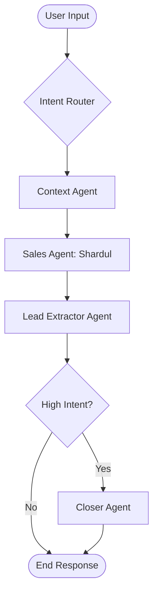

# 🌊 Seabreeze by Godrej Bayview: Shardul AI

[](https://fastapi.tiangolo.com/)
[](https://reactjs.org/)
[](https://langchain-ai.github.io/langgraph/)
[](https://deepmind.google/technologies/gemini/)

> **Shardul** is more than just a chatbot. He is a sophisticated, luxury-focused AI Relationship Manager designed to provide an elite, personalized experience for potential homebuyers at **Seabreeze by Godrej Bayview, Vashi**.

---

## 📖 Table of Contents
- [✨ Features](#-features)
- [🧩 Architecture](#-architecture)
- [🤖 Multi-Agent Workflow](#-multi-agent-workflow)
- [🛠️ Tech Stack](#️-tech-stack)
- [🚀 Quick Start](#-quick-start)
- [📂 Project Structure](#-project-structure)
- [📈 Lead Intelligence](#-lead-intelligence)

---

## ✨ Features

- **Shardul Persona**: An elite real estate sales consultant with a sophisticated, professional tone.
- **Multi-Turn Persistency**: Remembers conversation history and already-captured lead data across turns.
- **Context-Aware Intelligence**: Uses a **Direct Context Injection** pipeline to answer technical project queries (BHKs, Pricing, Amenities) with 100% accuracy.
- **Zero-Config Architecture**: Simplified backend with local JSON storage for leads—no external database required for deployment.
- **Structured Lead Capture**: Automatically extracts budget, preferred configuration (BHK), location, and intent level from natural conversation.
- **Intent-Driven Closing**: Identifies high-intent users and dynamically offers site visit invitations and calls.
- **Modern UI/UX**: A sleek, glassmorphic chat interface built with React 19 and Tailwind CSS 4.

---

## 🧩 Architecture

The system is built on a decoupled architecture, ensuring scalability and high performance.

### Context Engine
1. **Data Source**: `project_data.json` contains the full project specifications.
2. **Context Injection**: For 100% accuracy, the full project context is injected into Shardul's reasoning window, avoiding RAG retrieval errors.
3. **Session Memory**: Uses a session-based approach to maintain the last 10 turns of conversation history.

### Multi-Agent Workflow (LangGraph)
We utilize a state-machine based approach to manage complex sales conversations.



---

## 🤖 Multi-Agent Workflow

| Agent | Responsibility |
| :--- | :--- |
| **Router** | Classifies the user's intent level (Low, Medium, High). |
| **Context Agent** | Injects the full `project_data.json` context into the conversation state. |
| **Sales Agent** | The "Brain"—generates the luxury-toned response using history and project data. |
| **Lead Agent** | Analyzes the conversation to extract structured data (Budget, BHK, etc.). |
| **Closer Agent** | Triggered for High-intent users to provide a warm invitation for site visits. |

---

## 🛠️ Tech Stack

### Backend
- **Framework**: FastAPI (Python)
- **Orchestration**: LangGraph (LangChain)
- **AI Model**: Google Gemini 2.0 Flash
- **Logic**: State-Aware Prompting with Session History
- **Database**: Local JSON File Store (`leads.json`) for "Zero-Config" deployment.

### Frontend
- **Framework**: React 19
- **Build Tool**: Vite
- **Styling**: Tailwind CSS 4
- **Icons**: Lucide React
- **API Client**: Axios

---

## 🚀 Quick Start

### Prerequisites
- Python 3.10+
- Node.js 18+
- Gemini API Key
- MongoDB URI

### Backend Setup
1. `cd backend`
2. `pip install -r requirements.txt`
3. Create a `.env` file:
   ```env
   GEMINI_API_KEY=your_key_here
   PORT=8000
   ```
4. Run the server: `python main.py`

### Frontend Setup
1. `cd frontend`
2. `npm install`
3. Run dev server: `npm run dev`

---

## 📂 Project Structure

```bash
├── backend/
│   ├── agents/          # LangGraph nodes and graph definition
│   ├── services/        # RAG and business logic
│   ├── db/              # Database connections (Mongo)
│   ├── routes/          # FastAPI endpoints (Chat, Voice)
│   ├── data/            # Project specifications (json)
│   └── main.py          # Entry point
├── frontend/
│   ├── src/
│   │   ├── components/  # Chat UI and UI elements
│   │   └── App.jsx      # Main application
│   └── vite.config.js
└── README.md            # You are here
```

---

## 📈 Lead Intelligence

Every interaction is analyzed for lead potential. The system extracts:
```json
{
  "budget": "3.5 - 4.2 Cr",
  "bhk": "3 BHK",
  "location": "Vashi",
  "intent": "High"
}
```
*This data is stored in MongoDB for the sales team to follow up efficiently.*

---

<div align="center">
  <p>Built with ❤️ for <b>Seabreeze by Godrej Bayview</b></p>
</div>
